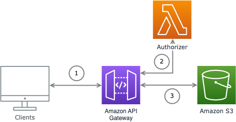

# Hello Photos!
The Hello Photos app shows how to use cedarpy and the Cedar Policy framework to authorize access to AWS resources. With cute dog and cat photos!

## What's wrong with the old way of authorizing requests?
Traditionally, most applications implement authorization logic with if/elif/else statements.  Something like:

```python
# load from e.g. path parameters
action = "Action::view"
photo_id = "a1b2-c3d4"
# resolve from authentication
user_id = "alice"

# load user and photo metadata, including relationships about which users own or can access which photos
user_metadata = load_user_metadata(user_id)
photo_metadata = load_photo_metadata(photo_id)

effect = "Deny"
if "Action::view" == action:
    if photo_metadata.account == user_id:
        effect = "Allow"
    elif user_metadata.groups and photo_metadata.groups_read:
        # is this user a member of any groups that are allowed to read the photo?
        for group_name in user_metadata.groups_read:
            if group_name in photo_metadata.groups:    
                effect = "Allow"
    else:
        pass
elif "Action::edit" == action:
    # if something else...
    pass
else:
    pass
```

And of course, this can go on for hundreds of lines.  The structure is entirely dependent on your principals, actions, resources and relationships between them.

A few common problems emerge from the 'traditional' imperative implementation of access control:

* Hard to scale development as more rules are added
* Hard to manage authz by selectively enabling or disabling rules
* Hard to understand what rules actually exist and how they interact

Which leads to:

Do you know what your authz rules _actually_ do? Can you prove it?

# Policy-based authorization systems and Cedar Policy
Smart people have thought about the relationships between principals, actions, and resources and authorization for a long time.  The Automated Reasoning group at AWS is full of people like that and they created Cedar Policy.

[Cedar Policy](https://www.cedarpolicy.com) is a fast, scalable access control system:

> Cedar is a language for defining permissions as policies, which describe who should have access to what. It is also a specification for evaluating those policies. Use Cedar policies to control what each user of your application is permitted to do and what resources they may access.

The language and evaluation engine are:

* Expressive
* Performant
* Analyzable

So now we can declare the same view photo access logic as:
```
@id("allow_owner_to_view_their_photos")
permit(
    principal, 
    action == Action::"view", 
    resource
)
when {
   resource.owner == principal
};                

@id("allow_friends_to_view_photos")
permit(
    principal, 
    action == Action::"view", 
    resource
)
when {
   principal in resource.groups_read
};                

```

## The Hello Photos app architecture

The Hello Photos example application uses a very simple Serverless architecture:



Let's explain the architecture by stepping through a request.

First, clients make http requests to the API Gateway.  Clients can request a photo resource with a path of the form: `/users/{userId}/photos/{photoId}`.  For example, `/users/alice/photos/a1b2-c3d4`.  The client must also authenticate the request using a bearer token.

Second, the API Gateway will verify the request is authorized by invoking the `hello-photos`  Authorizer Lambda function.  The Authorizer function unpacks the request and determines if the request is authorized using Cedar Policy and the [cedarpy](https://github.com/k9securityio/cedar-py) library.  The Authorizer will [respond to the gateway with an authorization decision expressed (essentially) as an IAM policy](https://docs.aws.amazon.com/apigateway/latest/developerguide/api-gateway-lambda-authorizer-output.html).

Third, if the caller is authorized, then the API Gateway will forward the request to the underlying photos bucket using the S3 direct integration. API Gateway then handles S3's response, returning the image if it's found or the error if one occurs (e.g. 404).  Notice that no Hello Photos application code is required to serve (proxy) the photo.

## Resources

Here are some helpful resources for building a Lambda Authorizer that uses Cedar Policy:

* [Cedar Policy](https://www.cedarpolicy.com) - learn more about the Cedar Policy authorization system
* [cedarpy](https://github.com/k9securityio/cedar-py) - Python bindings for the (Rust) Cedar library
* [How to build and use a custom API Gateway Lambda Authorizer](https://docs.aws.amazon.com/apigateway/latest/developerguide/apigateway-use-lambda-authorizer.html)
